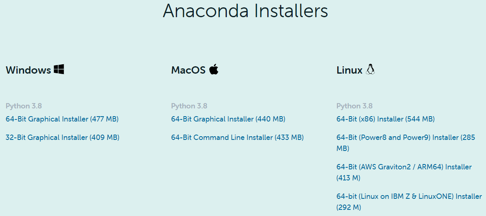
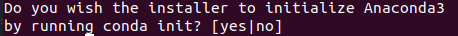

# AI-Assembly-Project
　이 소프트웨어는 파이썬, 텐서플로우 그리고 OpenCV로 구현되어 있으며 조립설명서에서 부품의 위치/종류/자세를 인식하는 기능으로 구성된다.

# SW 개발 환경
<table>
    <thead>
        <tr>
            <th>항목</th>
            <th>버전</th>
        </tr>
    </thead>
    <tbody>
        <tr>
            <td>운영체제</td>
            <td>Ubuntu 20.04 LTS</td>
        </tr>
        <tr>
            <td>프로그램 언어</td>
            <td>Python 3.5.6</td>
        </tr>
        <tr>
            <td>Tensorflow</td>
            <td>tensorflow-gpu 1.10.0</td>
        </tr>
        <tr>
            <td>opencv</td>
            <td>3.4.2</td>
        </tr>        
    </tbody>
</table>

# 환경 설정

**1. 아나콘다 설치**

[아나콘다 홈페이지](https://www.anaconda.com/products/individual)에 들어가서 Anaconda Python3.x Linux 버전을 다운로드 한다.

<div><p align="center"></p></div>

```
$ cd ~/Downloads
$ bash Anaconda3-2021.05-Linux-x86_64.sh
```

<div><p></p></div>

'yse'를 선택한다.

```
$ sudo nano ~/.bashrc
```

텍스트 편집기가 열리면 마지막줄에 "export PATH=~/anaconda3/bin:~/anaconda3/condabin:$PATH"를 추가하고 저장한다.

```
$ source ~/.bashrc
```

**2. 코드 다운로드**

```
$ git clone https://github.com/mysjyou21/AI-Assembly-Project
```

**3. 아나콘다 환경 빌드**

　코드를 다운로드한 폴더로 이동한다.
 
```
$ conda env create --file environment.yaml
$ source activate robot3.5
```

# 코드 실행

* input 설정
```
- data/input/image에 조립설명서 이미지 저장
- data/input/label에 label.txt로 ground-truth 정보 저장
```

* 데이터 전처리 모듈 실행
```
python main.py --mode test_data
```

* 전체 시스템 실행
```
python main.py --mode test
```

* 인식 모듈별 실행
```
# 부품 위치 인식 모듈
python main.py --mode detection
    >> --detection_visualization True : 이미지 결과 저장
    
# 부품 종류 인식 모듈
python main.py --mode retrieval
    >> --retrieval_visualization True : 이미지 결과 저장
    
# 부품 자세 인식 모듈
python main.py --mode pose
    >> --pose_visualization True : 이미지 결과 저장
```
## Download models from google drive

[[2019] Assembly Robot AI > 서울대 대용량 파일 공유](https://drive.google.com/drive/folders/1iMKuNfvyc5x8pfoO2DiyxCkWfwr13Jw0)에서 다운로드

* IKEArobot.zip

              function/Pose/data 폴더를 Second_Year/Mission2/function/Pose/data로 옮김
              model 폴더를 Second_Year/Mission2/model로 옮김

* Evaluation.zip

              1/model 폴더를 Evaluation/1/codes/model 로 옮김
              2/checkpoint 폴더를 Evaluation/2/codes/checkpoint 로 옮김
              3/model 폴더를 Evaluation/3/codes/model 로 옮김
              3/data/pose/view_imgs.npy 파일을 Evaluation/3/data/pose/view_imgs.npy 로 옮김
              3/data/input/npy/test_data.npy 파일을 Evaluation/3/data/input/npy/test_data.npy 로 옮김
