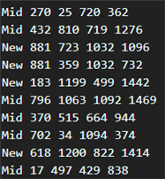
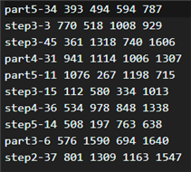
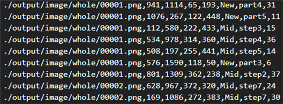
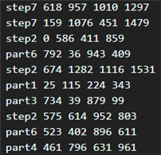

# AI-Assembly-Project
　이 소프트웨어는 파이썬, 텐서플로우 그리고 OpenCV로 구현되어 있으며 조립설명서에서 부품의 위치/종류/자세를 인식하는 기능으로 구성된다.


## SW 개발 환경
<table>
    <thead>
        <tr>
            <th>항목</th>
            <th>버전</th>
        </tr>
    </thead>
    <tbody>
        <tr>
            <td>운영체제</td>
            <td>Ubuntu 20.04 LTS</td>
        </tr>
        <tr>
            <td>프로그램 언어</td>
            <td>Python 3.5.6</td>
        </tr>
        <tr>
            <td>Tensorflow</td>
            <td>tensorflow-gpu 1.10.0</td>
        </tr>
        <tr>
            <td>opencv</td>
            <td>3.4.2</td>
        </tr>        
    </tbody>
</table>


## 환경 설정

**1. 아나콘다 설치**

[아나콘다 홈페이지](https://www.anaconda.com/products/individual)에 들어가서 Anaconda Python3.x Linux 버전을 다운로드 한다.

```
$ cd ~/Downloads
$ bash Anaconda3-2021.05-Linux-x86_64.sh
```

<div><p></p></div>

'yse'를 선택한다.

```
$ sudo nano ~/.bashrc
```

텍스트 편집기가 열리면 마지막줄에 

```
export PATH=~/anaconda3/bin:~/anaconda3/condabin:$PATH"
```
를 추가하고 저장한다.

```
$ source ~/.bashrc
```

**2. 코드 다운로드**

```
$ git clone https://github.com/mysjyou21/AI-Assembly-Project
```

**3. 아나콘다 환경 빌드**

코드를 다운로드한 폴더로 이동한다.
 
```
$ conda env create --file environment.yaml
$ source activate robot3.5
```


## 코드 실행

**1. input 설정**
```
data/input/image에 조립설명서 이미지 저장
data/input/label에 label.txt로 ground-truth 정보 저장
```

**2. 데이터 전처리 모듈 실행**
```
python main.py --mode test_data
```

**3-1. 전체 시스템 실행**
```
python main.py --mode test
```

**3-2 인식 모듈별 실행**
```
# 부품 위치 인식 모듈
python main.py --mode detection
    >> --detection_visualization True : 이미지 결과 저장
    
# 부품 종류 인식 모듈
python main.py --mode retrieval
    >> --retrieval_visualization True : 이미지 결과 저장
    
# 부품 자세 인식 모듈
python main.py --mode pose
    >> --pose_visualization True : 이미지 결과 저장
```


## 데이터 구성

```
./data/
├── detection/
│   └── bbox_answer/
├── input/
│   └── bbox_answer/
│   └── cad/
│   └── image/
│   └── label/
|       └── label.txt
│   └── npy/
|       └── test_data.npy
├── pose/
│   └── cornerpoints.npy
│   └── RTs.npy
│   └── view_imgs.npy
├── retrieval/
│   └── ground_truth/
│   └── lab2name.json
│   └── cornerpoints.npy
│   └── test_view.npy
```

* detection/bbox_answer/ : ‘부품 위치 인식 모듈’의 evaluation에 사용되는 ground-truth 텍스트 파일. class, left, top, right, bottom 의 형식이다. 이때 class는 New/Mid이고, 나머지는 bounding box 정보이다.

<div><p align="center"><br>bbox_answer 텍스트 파일 예시</p></div>

* input/bbox_answer/ : ‘부품 자세 인식 모듈’의 evaluation에 사용되는 ground-truth 텍스트 파일. class, left, top, right, bottom 의 형식이다. 이때 class는 (부품 종류)-(자세)이고, 나머지는 bounding box 정보이다.

<div><p align="center"><br>bbox_answer 텍스트 파일 예시</p></div>

* input/cad/ : 10가지 cad가 각가 obj 형식으로 저장되어있다
* input/image/ : 조립설명서 이미지를 저장하는 폴더
* input/label/label.txt : 조립설명서 이미지의 ground-truth 정보 텍스트 파일. 이미지 이름, left, top, width, height, class0, class1, class2 형식이다. 이때 class0는 New/Mid, class1은 부품 종류, class2는 자세 정보이며, 나머지는 bounding box 정보이다. 각 모듈을 evaluate 하기 위한 ground-truth 정보를 생성하는데 사용된다.

<div><p align="center"><br>label 텍스트 파일 예시</p></div>

* npy/test_data.npy (크기 : 10x1700x1200x3) : 조립설명서 이미지가 npy 형식으로 변환되어 저장된 것. 10은 이미지 개수에 해당된다.

* pose/cornerpoints.npy (크기 : 10x50x3) : 부품들의 CAD 정보가 pointcloud 형식으로 저장된 것. 10은 부품 종류 10가지에 해당된다.
* pose/RTs.npy (크기 : 48x3x4) : 자세 48가지의 회전행렬과 이동행렬 값을 3x4 행렬로 나타내어 npy 형식으로 저장된 것.
* pose/view_imgs.npy (크기 : 10x48x224x224x3) : 10가지 부품의 48가지 자세에 해당하는 이미지가 npy 형식으로 저장된 것.

* retrieval/ground_truth/ : ‘부품 종류 인식 모듈’의 evaluation에 사용되는 ground-truth 텍스트 파일. class, left, top, right, bottom 의 형식이다. 이때 class는 (부품 종류)이고, 나머지는 bounding box 정보이다.

<div><p align="center"><br>ground_truth 텍스트 파일 예시</p></div>

* retrieval/test_view.npy (크기 : 10x12x224x224x3) : 10가지 부품을 12가지 자세로 투영한 이미지를 npy로 저장한 형식. ‘부품 종류 인식 모듈’의 evaluation과 visualization에 사용됨.


## 코드 구성

* function/detection/ : ‘부품 위치 인식 모듈’ 관련 함수들이 저장된 폴더
* function/retrieval/ : ‘부품 종류 인식 모듈’ 관련 함수들이 저장된 폴더
* function/pose/ : ‘부품 자세 인식 모듈’ 관련 함수들이 저장된 폴더
* function/test/ : 전체 시스템 evaluation 관련 함수들이 저장된 폴더

* intermediate results/ : ‘부품 위치 인식 모듈’, ‘부품 종류 인식 모듈’, ‘부품 자세 인식 모듈’의 결과들을 저장하여 볼 수 있는 폴더
* model/ : 각 모듈의 checkpoint들이 저장되어있는 폴더
* output/ : 전체 시스템의 결과들을 저장하여 볼 수 있는 폴더
* args.py : hyperparameter들이 정의된 파일
* Evaluation_3.ipynb : 코드 설명이 있고, 여러 가지 모드로 테스트를 수행할 수 있는 파일로 main.py을 실행
* main.py : 테스트 모드를 나누어 quantative_report_pose.py를 실행
* quantative_report_pose.py : ‘데이터 전처리 모듈’, ‘부품 위치 인식 모듈’, ‘부품 종류 인식 모듈’, ‘부품 자세 인식 모듈’을 통합적으로 실행하는 파일


## Download models from google drive

[[2019] Assembly Robot AI > 서울대 대용량 파일 공유](https://drive.google.com/drive/folders/1iMKuNfvyc5x8pfoO2DiyxCkWfwr13Jw0)에서 다운로드

* IKEArobot.zip

              function/Pose/data 폴더를 Second_Year/Mission2/function/Pose/data로 옮김
              model 폴더를 Second_Year/Mission2/model로 옮김

* Evaluation.zip

              1/model 폴더를 Evaluation/1/codes/model 로 옮김
              2/checkpoint 폴더를 Evaluation/2/codes/checkpoint 로 옮김
              3/model 폴더를 Evaluation/3/codes/model 로 옮김
              3/data/pose/view_imgs.npy 파일을 Evaluation/3/data/pose/view_imgs.npy 로 옮김
              3/data/input/npy/test_data.npy 파일을 Evaluation/3/data/input/npy/test_data.npy 로 옮김
